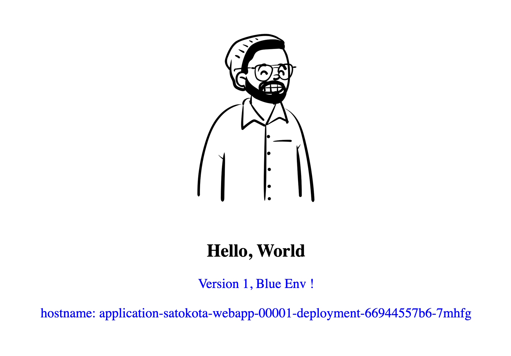
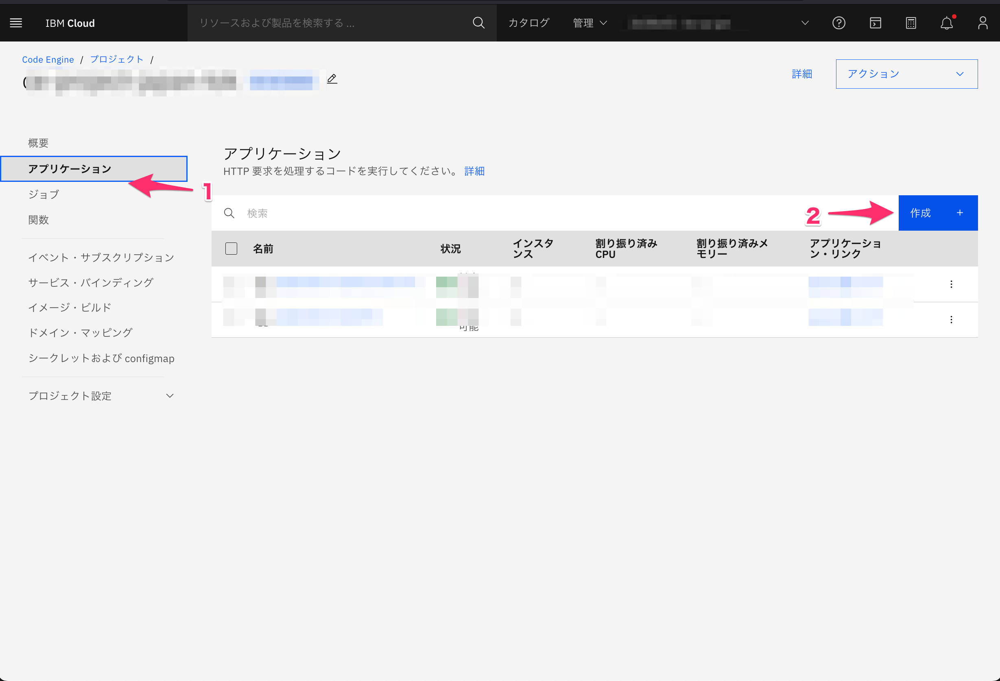
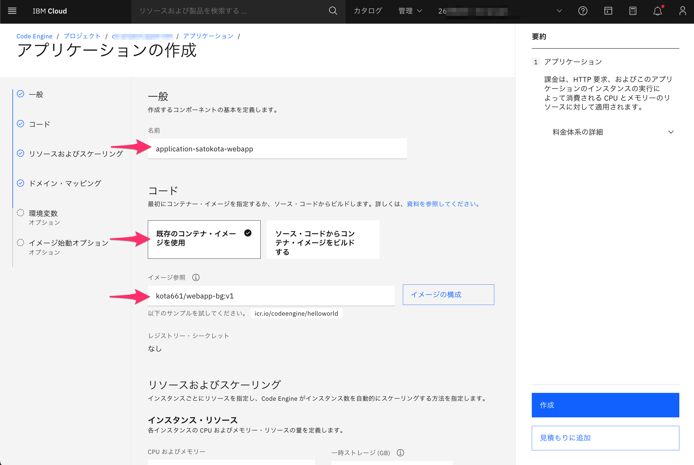
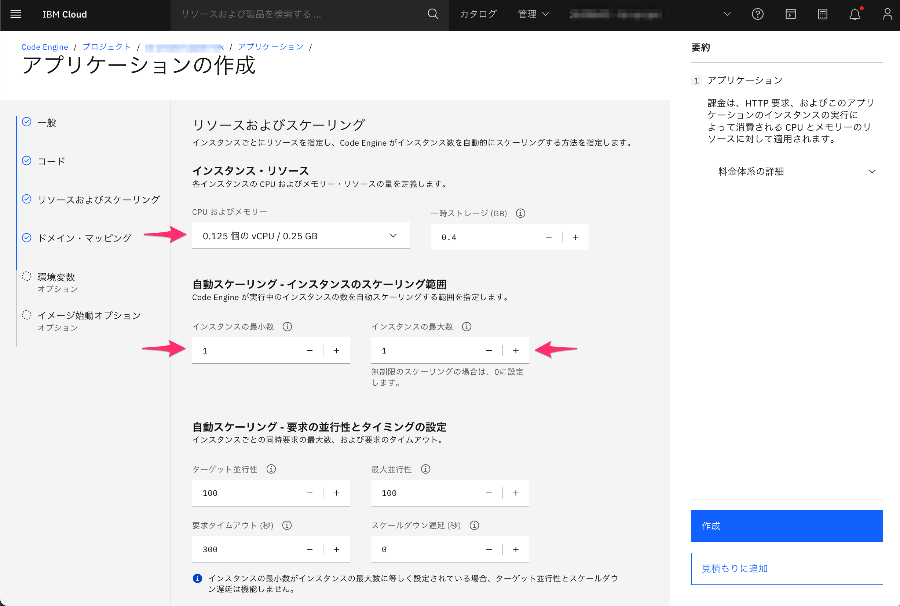
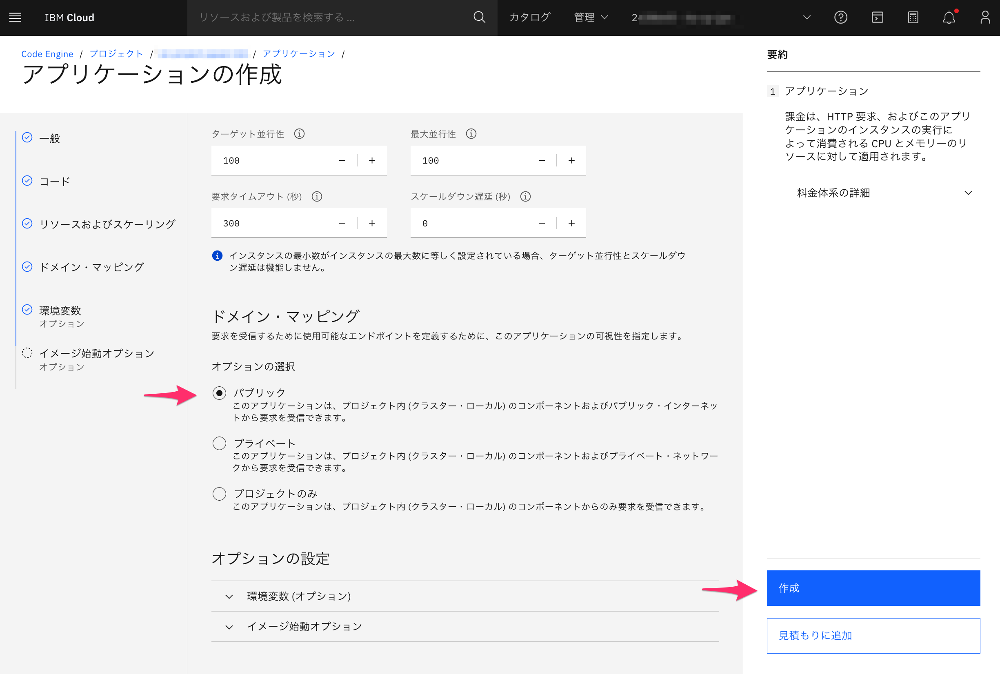
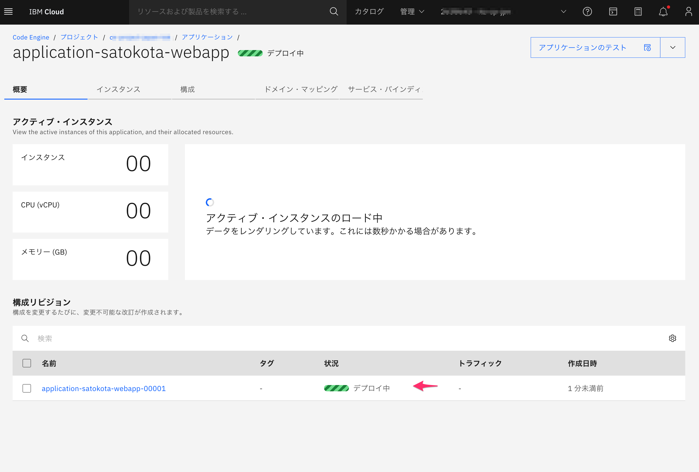
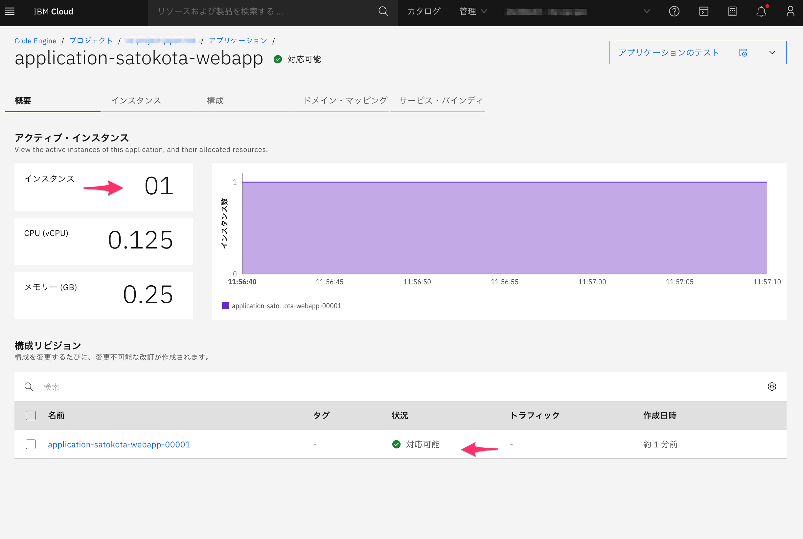
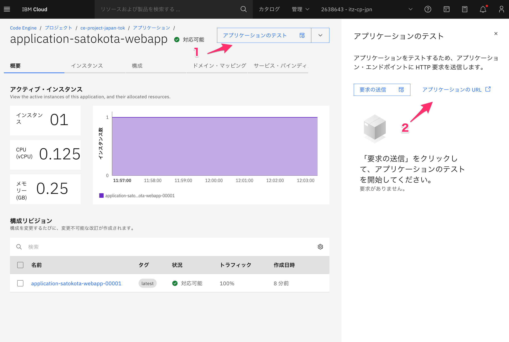
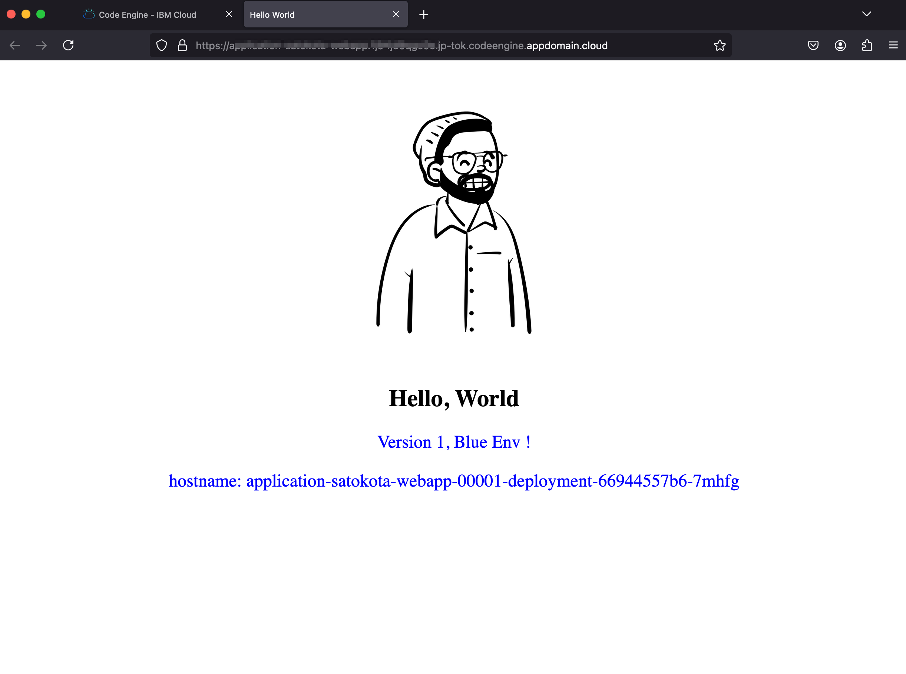

Lab2 Container Imageを利用したシンプルなアプリのデプロイ

- [概要とゴール](#概要とゴール)
- [アプリのデプロイ](#アプリのデプロイ)
- [最後に](#最後に)

## 概要とゴール

このLabではあらかじめビルドされたContainer Imageを利用してCode Engineにアプリをデプロイします。

Code EngineのアプリケーションではHTTPベースのアプリのデプロイが可能です。アプリへのアクセスはappdomain.cloudというドメインにて、自動的にhttpsで保護されたURLが割当られます。https://{アプリ名}.{ID}.{ロケーション 例：jp-tok}.codeengine.appdomain.cloud/

**ゴール**

* Code EngineにContainerImageを利用してアプリがデプロイできる
* 割当られたURLを利用してアプリにアクセスできる

**デプロイするサンプルアプリ**

このアプリではアプリのバージョンと、hostname（Pod名）が表示されます

## アプリのデプロイ

それではアプリを作成していきましょう！

1. まず初めに、プロジェクトの画面からアプリケーションをクリックし、一覧の右上にある作成ボタンをクリックします

   

2. アプリケーションの作成画面にて、まずはアプリ名とContainer Imageを指定します

   

   * 名前：application-{お名前}-webapp
   * コード：既存のkジョンテなイメージを使用 を選択 

   * イメージ参照: kota661/webapp-bg:v1

   

3. 次にアプリのリソース量やスケーリング範囲を設定します

   

   * インスタンス・リソース
     * CPUおよびメモリー：最小の 0.125個のvCPU/0.25GB を選択
   * 自動スケーリング - インスタンスのスケーリング範囲
     * インスタンスの最小数：１
     * インスタンスの最大数：１

   

4. 最後に、公開範囲の設定を行った後に、右下にある作成をクリックし、アプリを作成します

   

   

   オプションの選択：パブリック　を選択

   

   > 補足情報 アプリの公開範囲
   >
   > * パブリック
   >   * O インターネット経由でのパブリック・アクセス
   >   * O IBM Cloudにある仮想サーバーなどからのプライベートアクセス
   >   * O 同じプロジェクトからのアクセス
   > * プライベート
   >   * X インターネット経由でのパブリック・アクセス
   >   * O IBM Cloudにある仮想サーバーなどからのプライベートアクセス
   >   * O 同じプロジェクトからのアクセス
   > * プロジェクトのみ
   >   * X インターネット経由でのパブリック・アクセス
   >   * X IBM Cloudにある仮想サーバーなどからのプライベートアクセス
   >   * O 同じプロジェクトからのアクセス

   

   > 補足情報 - オプション設定で設定できる内容
   >
   > * 環境変数
   >   * 環境変数（オプション）を利用することで、個別にアプリの環境変数を定義可能です。アプリで利用するDBの接続情報など環境依存情報の受け渡しが行えます。
   > * イメージ始動オプション
   >   * コンテナー・イメージで定義されているcommandやargをを上書きできます
   >   * コンテナの監視に利用するReadiness Probe、Liveness Probeのポート番号や、監視頻度やタイムアウトを変更できます

   

5. アプリの状態が「デプロイ中」から 「対応可能」 になればデプロイ完了です！

   「デプロイ中」

   

   

   「対応完了」

   

   デプロイが完了し、１インスタンスで稼働していることがグラフで表示されます

   

6. それでは最後にアプリにアクセスしてみましょう！画面右上にある「アプリケーションのテスト」をクリックし、「アプリケーションのURL」をクリックします

   

7. Hello, Worldのアプリが表示されれば完了です！

   

   このアプリではアプリのバージョンと、hostname（Pod名）が表示されます

## 最後に

お疲れ様でした！、次の[Lab 3](../Lab3)に進んでください

