Lab3 スケーリング、アップデート＆ロールバック、ログ・メトリクス

- [概要とゴール](#概要とゴール)
- [Labの流れ](#labの流れ)
- [Step 1 - アプリのスケーリング設定](#step-1---アプリのスケーリング設定)
- [Step 2 - アプリのオートスケール、ゼロスケール設定](#step-2---アプリのオートスケールゼロスケール設定)
- [Step 3 - アプリのバージョンアップ](#step-3---アプリのバージョンアップ)
- [Step 4 - アプリのロールバック](#step-4---アプリのロールバック)
- [Step 5 - ログ・メトリクスの確認](#step-5---ログメトリクスの確認)
- [最後に](#最後に)

## 概要とゴール

このLabではLab2でデプロイしたアプリの本番運用を想定した、負荷分散の設定やバージョンアップ、ログ・メトリクスの確認を行います

ゴール

* アプリへのスケーリング設定を理解する
* アプリのバージョンアップが行える
* ログ・メトリクスの確認方法を理解する

## Labの流れ
1. アプリのスケーリング設定
2. アプリのオートスケール、ゼロスケール設定
3. アプリのバージョンアップ
4. アプリのロールバック
5. ログ・メトリクスの確認

## Step 1 - アプリのスケーリング設定

前回のLabではアプリを１インスタンスで常時起動する設定を行いました。ここでは水平スケールとして、複数インスタンスの設定や負荷に応じたオートスケールの設定を行います

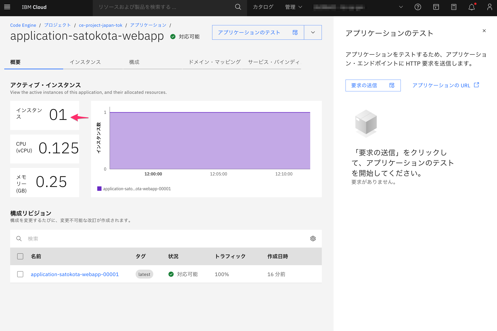

1. 「構成」＞「リソースおよびスケーリング」の順に選択し、スケーリング範囲を設定します

   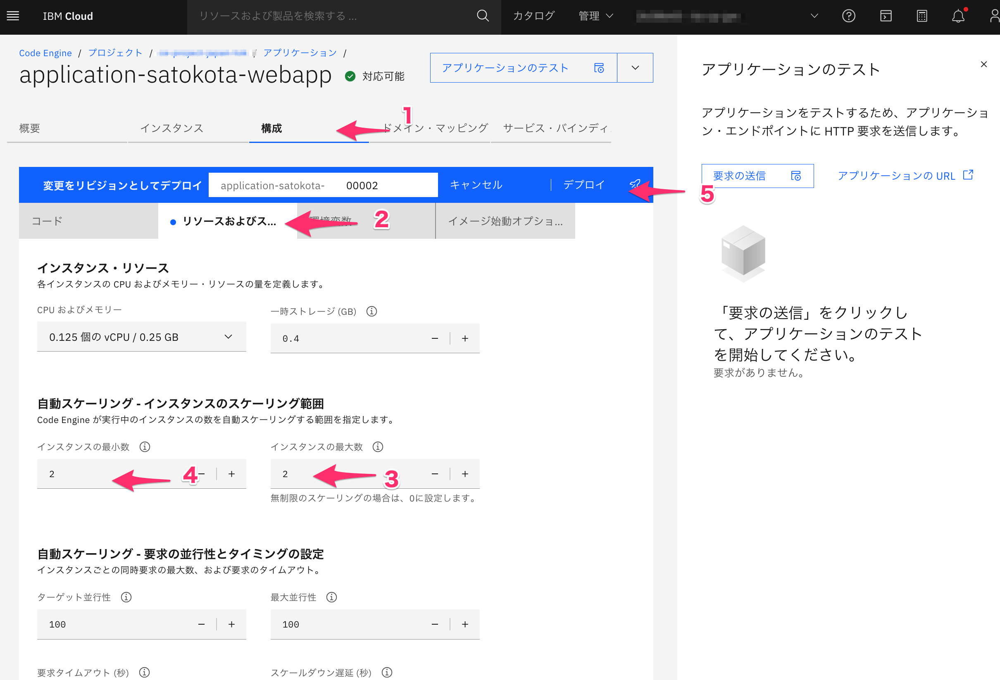

   * インスタンス・リソース
     * CPU およびメモリー：そのまま（最小の0.124vCPU/0.25GB）
       ※垂直スケールを行いたい場合は個々でより多いCPUやメモリの割当が行えます
   * 自動スケーリング - インスタンスのスケーリング範囲
     * インスタンスの最大数: 2
     * インスタンスの最小数: 2

   > 補足情報 - 水平スケールと垂直スケール
   >
   > * 水平スケール
   >
   >   同じ能力を持つ複数のインスタンスを追加することでシステム全体の処理能力を向上させます。例えば、Webサーバーを3台から10台に増やすことで、より多くのリクエストを同時に処理できるようになります。
   >
   > * 垂直スケール
   >   既存のインスタンスのリソース（CPU、メモリ、ストレージなど）を増強することで処理能力を向上させます。例えば、データベースサーバーのRAMを16GBから64GBに増やすことで、より大きなデータセットを高速に処理できるようになります。
   >
   > 水平スケールは柔軟性が高く、障害耐性に優れていますが、アプリケーションの設計に分散処理の考慮が必要です。垂直スケールは実装が比較的容易ですが、ハードウェアの制限があり、コストが高くなる傾向があります。

   

2. 「概要」タブに戻り、新しい設定が反映されるのを待ちます。（前回設定との切り替えの間一時的に３インスタンスで稼働します）

   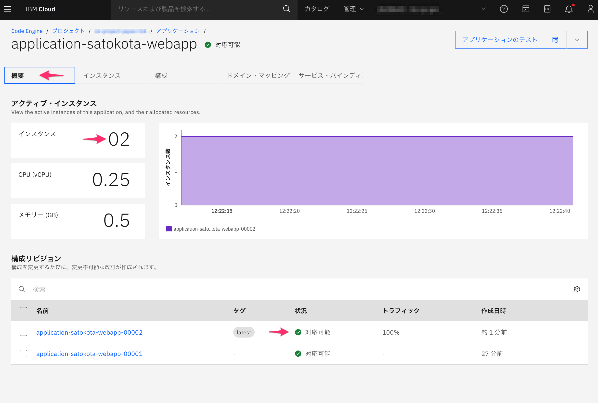

   

3. それではアプリにアクセスして、複数インスタンスに処理が割り振られていることを確認します
   画面右上の「アプリケーションのテスト」からアプリにアクセスし、何度かリロードを行ってください
   表示されるhostnameが変わる（アクセスが分散している）ことが確認できます

   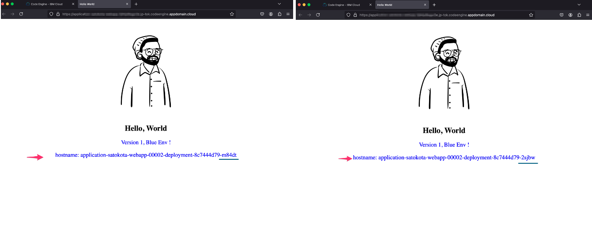

   

## Step 2 - アプリのオートスケール、ゼロスケール設定

前回のStepでは固定値での負荷分散を設定しました。このStepでは、負荷に応じたオートスケールを設定します。

オートスケールでは１台から３台のように負荷に応じて台数を増やしていきますが、Code Engineでは更に、アクセスがない場合、インスタンス台数を０台にし、アクセスがあった際に初めてインスタンスを起動させるゼロスケールに対応しています。

ゼロスケールを利用することでアクセスが無いときは課金を抑えることが可能です

1. それでは設定していきましょう！「構成」＞「リソースおよびスケーリング」の順に選択肢、最小数を**０**に設定しデプロイします

   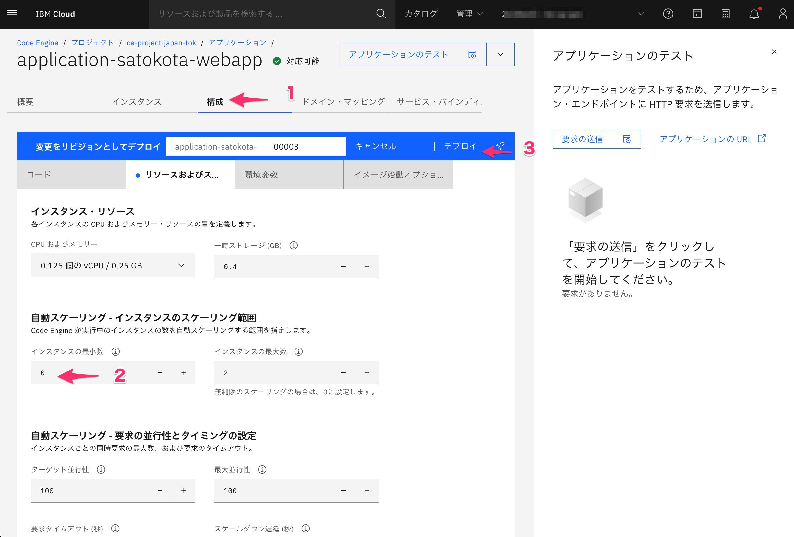

2. 「概要」タブに戻り、新しい設定が反映されるのを待ちます。（前回設定との切り替えの間一時的に３インスタンスで稼働します）

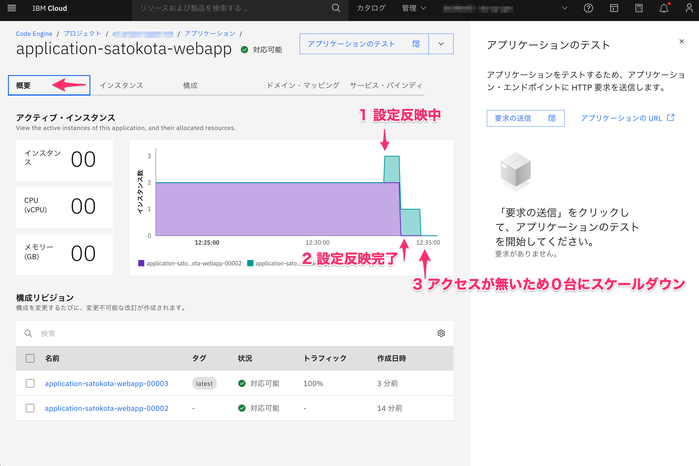

3. 改めて、アプリにアクセスしてみます。アクセス後、数十秒ほど待つとアプリが表示されます。「概要」の画面でもインスタンスが０台ったのが１台へと増えていることが確認できます

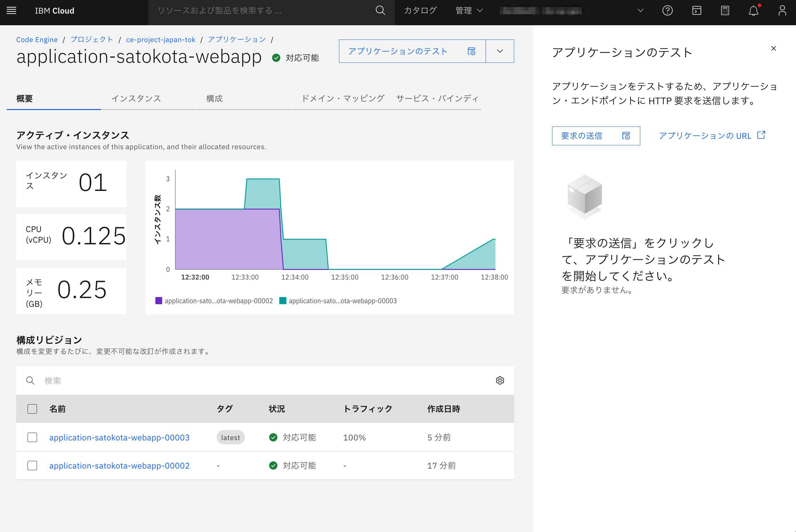

> 補足情報
>
> ゼロスケール状態からのアプリアクセスでは、リソースの割当量やアプリの処理内容に応じて数十秒から１分ほどの待ち時間が発生します。
>
> 開発環境・社内利用など、初回アクセス時の遅延が許容できる場合に利用してください
>
> エンドユーザーが直接アクセスするアプリなど遅延が許容されない場合での利用はおすすめしません。

## Step 3 - アプリのバージョンアップ

次に、新しいアプリへのバージョンアップを行ってみましょう。といっても一瞬です。

1. 「構成」＞「コード」から実行するイメージのタグを変更します

   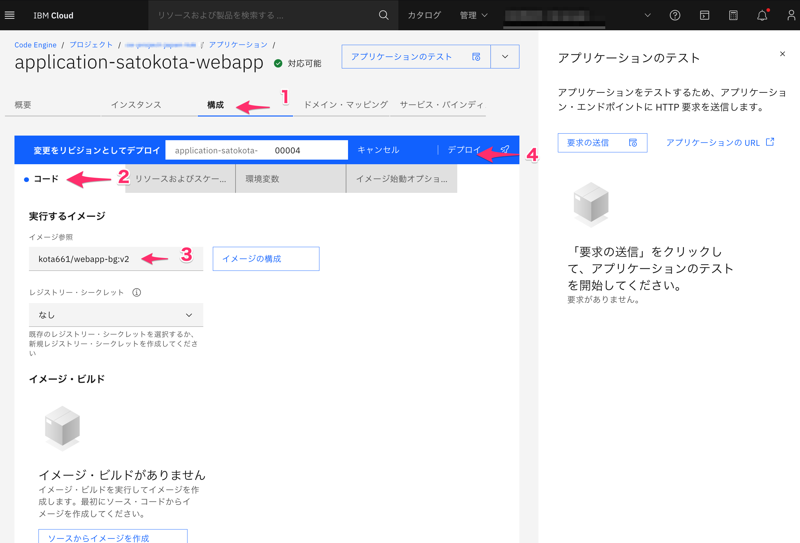

   * イメージ参照: kota661/webapp-bg:v1  から kota661/webapp-bg:v2 へ変更

   

2. 「概要」から設定が反映されるのを待ち、アプリにアクセスしてみます（URLはV1のときと同じです。）

   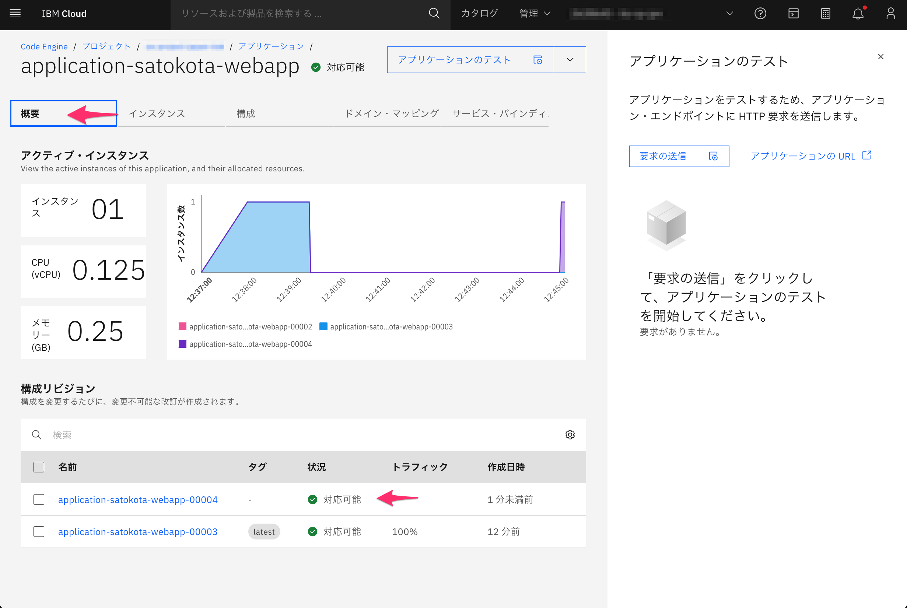

   

3. 構成にて利用するImage名を変更するだけで、V1の時と同じURLにて、新しいV2のアプリへとバージョンアップが行えました！

   オートスケールの設定などはそのまま変更されず引き継がれます

   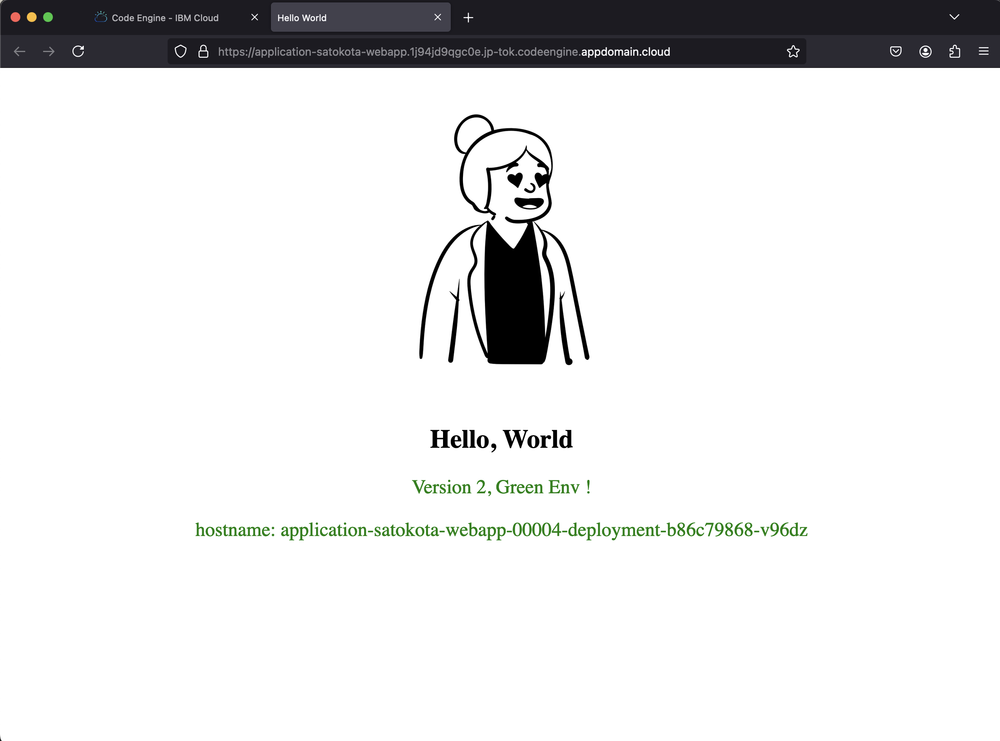

   

   

## Step 4 - アプリのロールバック

バージョンアップしたアプリが問題なく稼働すればいいのですが、どうしてもバグなどで元に戻したい場合があると思います。そんなときのロールバックを試して見ましょう

1. 「選択されたリビジョン」から前回のリビジョンを選択します

   イメージ参照がv1へと戻っていることを確認の上、「再デプロイ」をクリックし、その後の作成された新しいリビジョンをデプロイします

   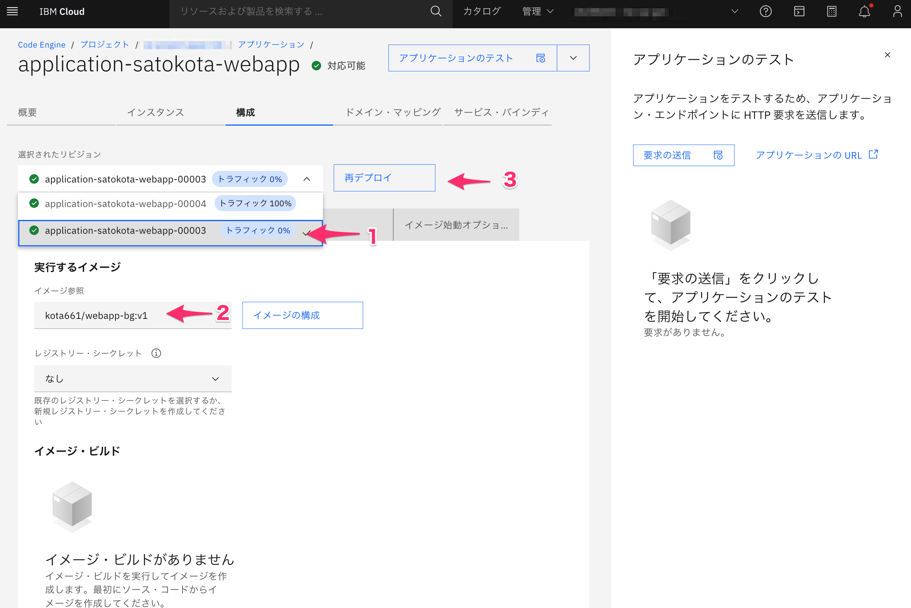

2. 「構成」タブに戻りロールバックしたリビジョンが「対応可能」となっていることを確認し、アプリにアクセスします

   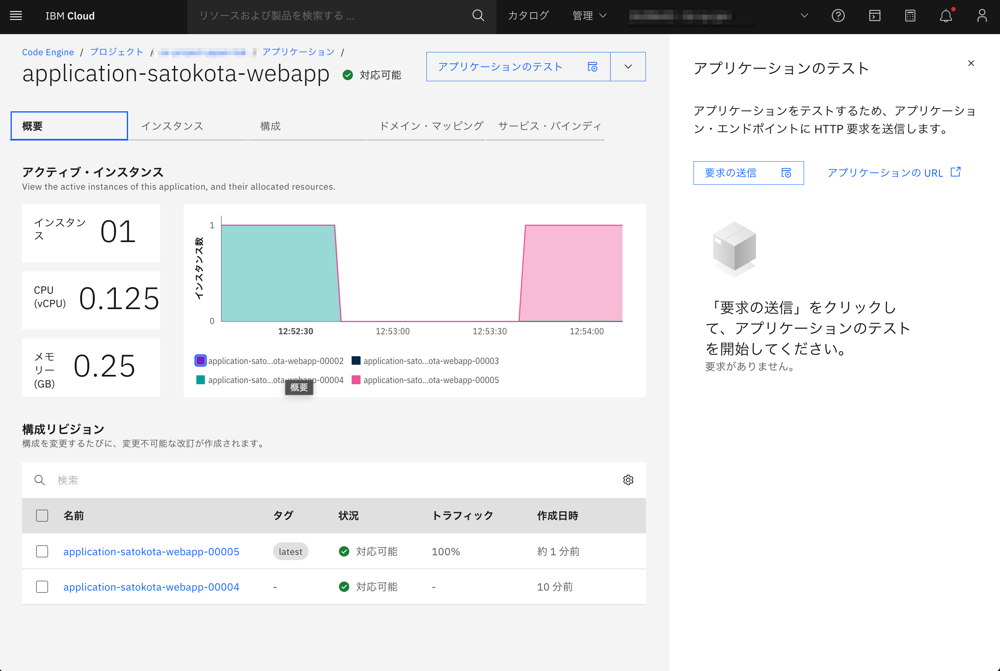

   v1のアプリが表示されれば、ロールバック完了です

   

## Step 5 - ログ・メトリクスの確認

アプリのログやメトリクスは、IBM Cloudが提供しているログサービスやモニタリングサービスにてプラットフォームログやプラットフォームメトリクスの収集・分析設定を行うことで確認可能です。

詳細はIBM Cloud Docsをご参照ください

* [ログの表示](https://cloud.ibm.com/docs/codeengine?topic=codeengine-view-logs&interface=ui#view-appjobfunctionlogs-ui)

* [Code Engine のモニタリング](https://cloud.ibm.com/docs/codeengine?topic=codeengine-monitor&interface=ui)

  

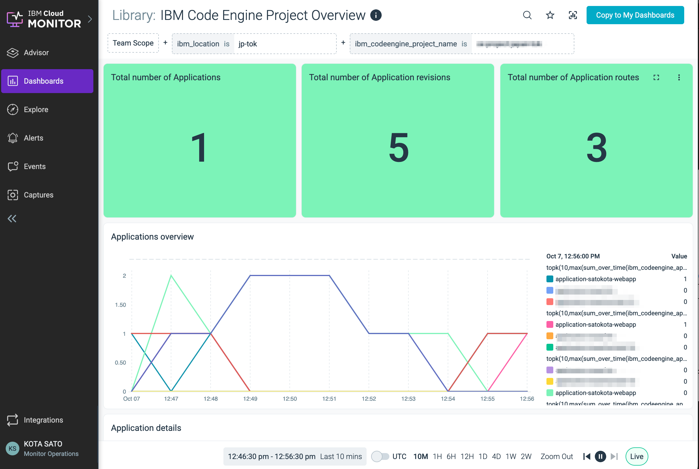

## 最後に
お疲れ様でした！、次の[Lab 4](../Lab4)に進んでください

